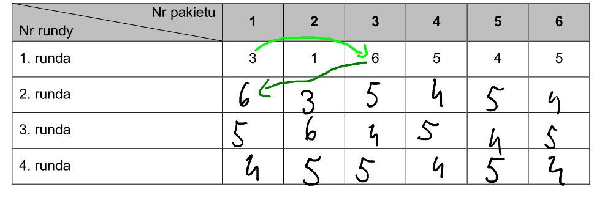

W kolumnach mamy pakiety, a w komórkach mamy komputery.
Patrzymy co znajduje sie w komórce pierwszej. Mamy tam 3 (trzeci komputer, w pierwszym pakiecie,
wynika to z treści zadania), więc teraz musimy sprawdzić co kryje się pod 3 pakietem. Jest tam 6,
czyli przepisujemy 6 do następnej rundy pod pakietem 6. Tę sytuację można opisac tak, że patrzymy co
jest w danej komórce (w tym przypadku 3) i idziemy w kolumnę opisaną tym numerem w tym wierszu, i
stamtąd bierzemy cyfrę do następnej komórki (w tym przypadku 6).

Zróbmy jeszcze jedną komórkę! W następnej, drugiej kolumnie, pierwszym wierszu mamy 1. Sprawdzamy co
jest w pierwszej kolumnie (bo w komórce jest 1). Jest to 3, więc w 2 wierszu, w tej samej kolumnie
wpisujemy 3. Chodzi o to, żeby brać liczby z wierszy i wstawiać je w następne kolumny.

Jak coś trzeba wyjaśnić to zgłoś issue.